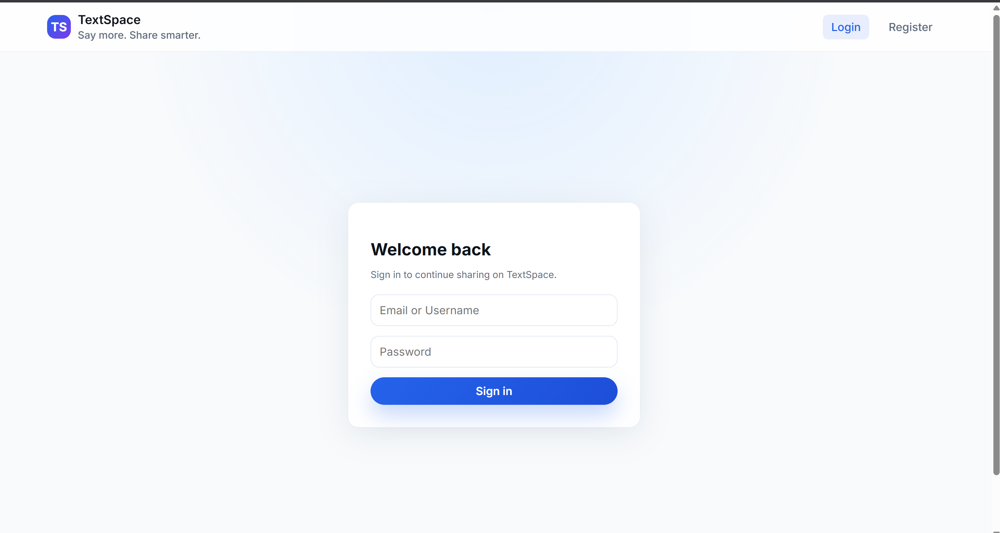
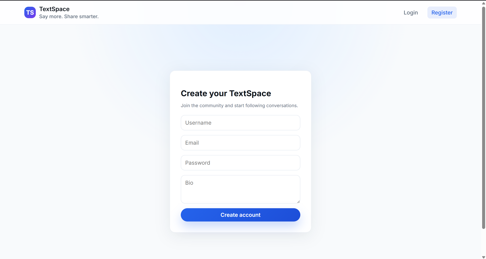
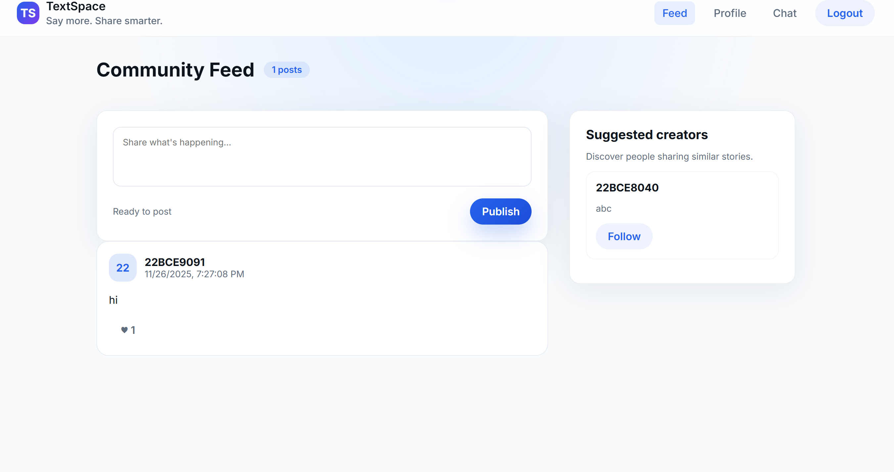
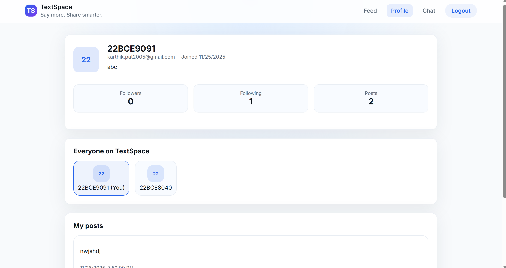
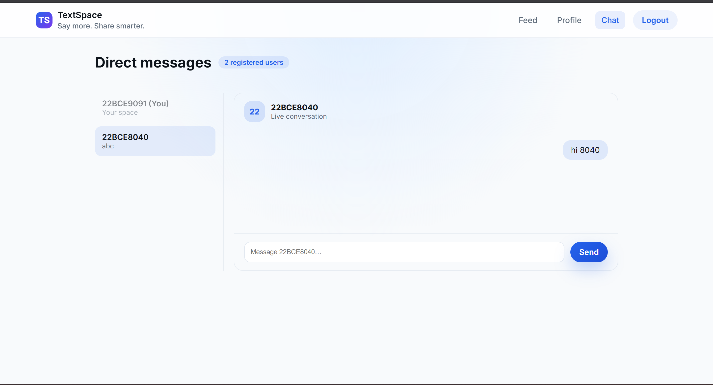

# TextSpace – Social Media Web Application

TextSpace is a modern full-stack social media platform where users can create posts, follow others, manage profiles, and chat in real time.  
Built using **React**, **Node.js**, **Express**, **MongoDB**, and **Socket.IO**, this project delivers a smooth and engaging social experience.

---

## 🚀 Features

### 🔐 Authentication  
- Register and Login  
- JWT-based secure authentication  
- Password hashing  

### 📝 Posts  
- Create posts  
- Like & Unlike  
- Real-time feed updates  

### 👥 Social  
- Follow / Unfollow users  
- Suggested creators section  
- Dynamic followers & following count  

### 💬 Real-Time Chat  
- Instant messaging using Socket.IO  

### 👤 Profile  
- View user details  
- Followers, following, and post count  
- Clean and responsive UI  

---

## 📸 Screenshots

### 🔑 Login Page  


### 📝 Register Page  


### 📰 Feed Page  


### 👤 Profile Page  


### 💬 Chat Page  


---

## 🛠 Tech Stack

### Frontend  
- React.js  
- Axios  
- Context API  
- Vite  

### Backend  
- Node.js  
- Express.js  
- MongoDB + Mongoose  
- Socket.IO  
- JWT Authentication  

---

## 📦 Installation

### 1️⃣ Clone the repository  
```bash
git clone https://github.com/karthik-0108/TextSpace.git
cd TextSpace
```

### 2️⃣ Backend Setup  
```bash
cd backend
npm install
```

Create a `.env` file inside **backend**:

```
MONGO_URI=your_mongo_connection_string
JWT_SECRET=your_secret_key
PORT=5000
```

Start backend:

```bash
npm start
```

### 3️⃣ Frontend Setup  
```bash
cd ../frontend
npm install
npm run dev
```

---

## 🤝 Contributing  
Contributions, issues, and feature requests are welcome!

---

## 🧑‍💻 Author  
**Karthik KB**

---

## ⭐ Support  
If you like this project, give it a ⭐ on GitHub to show support!

